# Cookiebot CI/CD

In this project, the build and deployment of **Cookiebot** will be fully automated through GitLab CI using Terraform, Ansible, and Vault. 
This eliminates the need to manually connect to the machine to perform deployment steps. 
The certificate and passwords will be securely stored in HashiCorp Vault, facilitating easy management and providing a clear audit trail.

After each commit, the pipeline will execute a build and run tests. 
Creating a Git tag will trigger a direct deployment of Cookiebot, automating the entire process.

## Index

<!-- TOC -->
* [Cookiebot CI/CD](#cookiebot-cicd)
  * [Index](#index)
  * [Overview](#overview)
  * [**Tool Responsibilities:**](#tool-responsibilities)
  * [**Learning path**](#learning-path)
    * [Gitlab](#gitlab)
    * [Ansible](#ansible)
    * [Vault](#vault)
    * [Terraform](#terraform)
  * [**Challenge Overview: The Cookiebot Automated Deployment**](#challenge-overview-the-cookiebot-automated-deployment)
    * [**I. GitLab CI: The Orchestrator**](#i-gitlab-ci-the-orchestrator)
    * [**II. Terraform: The Infrastructure Architect**](#ii-terraform-the-infrastructure-architect)
    * [**III. Ansible: The System Configurator**](#iii-ansible-the-system-configurator)
    * [**IV. HashiCorp Vault: The Guardian of Secrets**](#iv-hashicorp-vault-the-guardian-of-secrets)
    * [**✅ Definition of Done**](#-definition-of-done)
<!-- TOC -->

## Overview

```mermaid
flowchart TD
    subgraph subGraph0["💻 Ambiente Local"]
        A[/"<br>👩‍💻<br><b>Developer (Melany)</b>"\]
    end
    subgraph subGraph1["CI: Build & Test (A cada 'git push')"]
        C("GitLab CI")
        B["Inicia pipeline"]
        D{"Maven"}
        E("fa:fa-archive Cookiebot.jar")
    end
    subgraph subGraph2["CD: Deploy (A cada 'git tag')"]
        G("GitLab CI")
        F["Inicia pipeline"]
        H("fa:fa-cogs Ansible")
        I("fa:fa-file-code Terraform")
        J("fa:fa-cloud Google Cloud")
        K("fa:fa-server VM do Cookiebot")
        L("fa:fa-key HashiCorp Vault")
        M["🤖 <b>Cookiebot Online!</b>"]
    end

    B -- "1\. Aciona Pipeline" --> C
    C -- Usa Imagem<br>Docker p/ Build --> D
    D -- Gera Artefato --> E
    F -- "2. Aciona Deploy" --> G
    G -- Executa Job de Deploy --> H & I
    I -- Provisiona / Verifica --> J
    J -- Cria / Garante a VM --> K
    H -- Busca Segredos<br>(Token, Certificado) --> L
    H -- Configura e Implanta --> K
    E -- Copiado por Ansible --> K
    K -- Executa o Bot --> M
    A -- git push na branch main --> B
    A -- "Cria git tag (ex: v1.2)" --> F

    A:::person
    C:::tool
    D:::tool
    E:::result
    G:::tool
    H:::tool
    I:::tool
    J:::cloud
    K:::result
    L:::tool
    M:::result

    classDef person fill:#E6E6FA,stroke:#333,stroke-width:2px
    classDef tool fill:#D4EDDA,stroke:#155724,stroke-width:2px
    classDef cloud fill:#CCE5FF,stroke:#004085,stroke-width:2px
    classDef result fill:#F8D7DA,stroke:#721c24,stroke-width:2px
    classDef process stroke:#333,stroke-width:4px,stroke-dasharray: 5 5
```

## **Tool Responsibilities:**

- **GitLab:**
    * Handles the build and generation of artifacts (JAR file, native executable generated with GraalVM).
    * Triggers automated deployment upon Git tag creation using **Ansible**.
    * Uses Docker images within GitLab CI for the build process and for executing Ansible and Terraform.

- **Terraform:**
    * Creates the virtual machine on Google Cloud that will be used by Cookiebot.

- **Ansible:**
    * Creates and configures the **systemd service** on the target machine.
    * Copies the new version of Cookiebot to the machine.
    * Fetches the certificate and passwords from Vault to be copied into configuration files on the machine.
    * Restarts the Cookiebot service.

- **Vault:**
    * Stores the certificates and passwords used by Cookiebot, which will be fetched by Ansible at deployment time.
    * Provides secure access and a detailed audit log.

## **Learning path**

### Gitlab

- [1 - From Code to First Build](../../gitlab/01-first-projet-ci/README.md).
- [2 - Building with Speed and Intelligence](../../gitlab/02_build_cache.md)
- [3 - Pipeline Flow with `needs` and `artifacts`](../../gitlab/03_artifacts_needs.md)
- [4 - Building Native Images with Docker and GraalVM](../../gitlab/04_build_docker.md)

### Ansible

- [1 - Cookiebot deploy](../../ansible/01_cookiebot_deploy.md)

### Vault

- [Vault complete overview](https://www.youtube.com/watch?v=klyAhaklGNU)
- [1 - Introduction to Secrets Management with HashiCorp Vault](../../vault/01_vault_fundamentals.md)
- [2 - Understanding the Lifecycle of a Vault Token](../../vault/02_vault_tokens.md)
- [3 - Authoring Vault Policies for Access Control](../../vault/03_vault_policies.md)
- [4 - Vault Authentication Methods in Practice](../../vault/04_vault_auth.md)
- [5 - Managing Dynamic Secrets and Tokens with Vault Leases](../../vault/05_vault_leases.md)

### Terraform

- [Get Started - Google Cloud](https://developer.hashicorp.com/terraform/tutorials/gcp-get-started)

## **Challenge Overview: The Cookiebot Automated Deployment**

**Goal:** 

To build a complete, secure, and automated CI/CD pipeline that takes the Cookiebot application from source code to a fully configured, running service on Google Cloud. 
This project will integrate all the core tools of modern DevOps and serve as a powerful, real-world portfolio piece.

### **I. GitLab CI: The Orchestrator**

The `.gitlab-ci.yml` file will be the heart of our automation, defining the entire workflow from build to deploy.

**Requirements:**
1.  **Pipeline Structure:** The pipeline must have at least three distinct stages: `build`, `test`, and `deploy`.
2.  **Build Job (`build_native_cookiebot`):**
    * This job must run on every push to the `main` branch.
    * It will use the **Docker executor**.
    * It must use a specific **GraalVM Docker image** (e.g., `ghcr.io/graalvm/native-image-community:17`) to compile the Java application into a native executable.
    * The final native executable must be saved as a **job artifact**, making it available for the deploy stage.
3.  **Deploy Job (`deploy_to_production`):**
    * This job must be configured to run **only when a Git tag is created** (e.g., `v1.0.0`, `v1.1.0`). Use the `rules` keyword for this.
    * It will use a **custom or pre-built Docker image** that contains all the necessary client tools: `Terraform`, `Ansible`, and `Vault`.
    * The script within this job will be responsible for orchestrating the entire deployment process.
4.  **Variable Management:**
    * The Google Cloud Service Account Key must be stored as a **"File" type CI/CD variable**.
    * The Vault address (`VAULT_ADDR`) must be stored as a standard CI/CD variable. **No static Vault tokens should be stored.**

### **II. Terraform: The Infrastructure Architect**

Terraform will be responsible for creating and managing the Google Cloud infrastructure where Cookiebot will live.

**Requirements:**

1.  **Provider:** The configuration must use the `hashicorp/google` provider.
2.  **Resources to Create:**
    * `google_compute_instance`: A single, small VM (e.g., `e2-micro`) to run the bot.
    * `google_compute_firewall_rule`: A firewall rule to allow SSH access to the VM for Ansible.
3.  **State Management:** The Terraform state must be managed remotely using GitLab's own **Terraform State Backend**. This is a critical best practice.
4.  **Outputs:** The configuration must have an `output` that exposes the public IP address of the created VM. 
The CI/CD pipeline will use this to pass the IP to Ansible.

### **III. Ansible: The System Configurator**

Ansible will connect to the VM created by Terraform and configure it to run Cookiebot perfectly.

**Requirements:**

1.  **Inventory:** The playbook will use a dynamic inventory. The IP address from the Terraform output will be passed to the `ansible-playbook` command in the GitLab CI job.
2.  **Playbook Tasks:** The playbook must perform the following actions in order:
    * Ensure a dedicated user (e.g., `cookiebot_user`) exists.
    * Create the application directory (e.g., `/opt/cookiebot`).
    * **Copy the native executable** from the GitLab job's artifacts to the application directory.
    * **Fetch secrets from Vault** (see Vault section below) and use the `template` or `copy` module to create the necessary configuration files (e.g., `application.properties`, SSL certificates) on the VM.
    * Use the `template` module to create a **`systemd` service file** for Cookiebot (`/etc/systemd/system/cookiebot.service`).
    * Use the `systemd_service` module to enable and **restart** the Cookiebot service, ensuring the new version is running. Use **handlers** for efficient restarts.

### **IV. HashiCorp Vault: The Guardian of Secrets**

This is a critical component for ensuring a secure deployment. 
We will configure Vault to trust GitLab, allowing pipelines to authenticate without any long-lived tokens.

**Requirements:**

**A. One-Time Vault Configuration (To be done manually using Terraform in a separate repository):**
1.  **Enable JWT Auth Method:** The JWT auth method must be enabled in Vault.
2.  **Configure JWT Auth:** The auth method must be configured to trust GitLab by pointing to its JWKS endpoint. 
It also needs to be bound to your specific GitLab project.
3.  **Create Vault Policies:** A policy named `cookiebot-app-policy` must be created. 
This policy will grant read-only access to the secrets needed for the deployment.
4.  **Create the JWT Role:** A role named `cookiebot-deploy-role` will tie everything together. 
This role connects the GitLab JWT authentication to the policy you created, but only for jobs that match specific criteria (e.g., running from a tag on your project's `main` branch).
    - This role will bind claims like `project_path`, `ref_type`, and `ref`.

**B. Secret Structure in Vault:**
1.  The secrets must be stored in the KVv2 engine at the following paths:
    * `secret/database/cookiebot`: Should contain keys like `db_user`, `db_password`, etc.
    * `secret/app/cookiebot`: Should contain keys for the `telegram_token` and the `ssl_certificate`/`ssl_key`.

**C. Integration with Ansible:**
1.  The GitLab CI `deploy` job will automatically have access to a short-lived JWT token (`CI_JOB_JWT_V2`).
2.  The Ansible playbook, when run from the pipeline, must use this JWT to authenticate against Vault and fetch the secrets from the paths defined above.

### **✅ Definition of Done**

The challenge is considered complete when the following workflow is successful:

1.  A `git push` to the `main` branch successfully runs the `build` and `test` jobs.
2.  Creating and pushing a new Git tag (e.g., `git tag v1.3.0 && git push origin v1.3.0`) triggers the `deploy` job.
3.  The `deploy` job successfully runs `terraform apply` to create or verify the GCE VM.
4.  The job then successfully runs `ansible-playbook`, which:
    * Authenticates to Vault using the pipeline's JWT token.
    * Fetches all required secrets.
    * Copies the new native executable and configuration to the VM.
    * Restarts the `systemd` service.
5.  You can verify that the new version of the Cookiebot is online and running correctly on the Google Cloud VM.